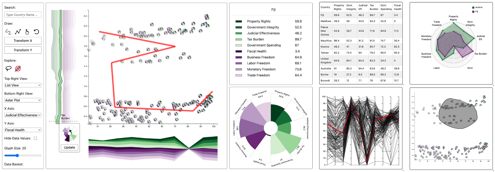

# AxiSketcher

AxiSketcher is an advanced interactive visualization tool designed to enable users to create and manipulate nonlinear axes using intuitive sketch-based interactions. This tool empowers users to integrate their domain knowledge directly into visual analytics, enhancing data exploration and decision-making capabilities. Our reimplementation enhances user experience with a refined layout and additional supporting views.



## Overview

AxiSketcher reimagines data interaction by allowing users to sketch nonlinear axes on scatter plots and visualize multidimensional data with deeper insights. This tool provides flexible, user-driven axis creation, surpassing traditional data analysis methods by seamlessly integrating user insights into visualizations.

### Key Features

- **Sketch-Based Axis Creation**: Users can create custom nonlinear axes through point selection, polyline drawing, or freeform sketching.
- **Interactive Scatter Plot**: The main view displays data points as aster plot glyphs, offering a comprehensive overview of relationships between attributes.
- **Axis Rainbow**: A ThemeRiver-style visualization that depicts attribute contributions along user-created axes, providing insights into attribute variation.
- **Supporting Views**: Includes a variety of views such as List View, Table View, Aster Plot, Parallel Coordinates Plot, and Radar Plot, providing users with multiple perspectives and deeper insights into their data.

## Usage

### Main Functionalities

- **Create Nonlinear Axes**:
  - **Select Points**: Click on data points to form a polyline.
  - **Draw Polylines**: Click and drag to sketch polylines on the scatter plot.
  - **Freeform Drawing**: Draw curves directly for a natural user experience.
- **Axis Visualization**: View and adjust attribute contributions using the Axis Rainbow.
- **Refine Axes**: Modify attribute importance interactively with the Aster plot.

### Supporting Views

- **List View**: Shows attribute details for hovered or selected points.
- **Table View**: Displays comprehensive attribute data for selected data points.
- **Aster Plot**: Visualizes multiple attribute values for a data point, aiding in multivariate analysis.
- **Parallel Coordinates Plot**: Connects data attributes with highlighted paths for selected points.
- **Radar Plot (Extension)**: Facilitates comparison between two data points by mapping their attributes on separate axes.

### Interaction Features

- **Search**: Locate specific data points with search functionality.
- **Lasso Selection**: Select and explore specific data clusters intuitively.
- **Axis Transformation**: Set new axes from user-drawn lines to customize the scatter plot.
- **Adjustable Glyphs**: Customize glyph size for better data visibility.
- **Data Basket**: Collect and manage specific data points for targeted analysis.

## Dataset

The tool currently employs the [**Economic Freedom Index** dataset](https://www.kaggle.com/datasets/lewisduncan93/the-economic-freedom-index) from Kaggle. This index assesses countries based on 12 factors, categorized under four pillars:

- **Rule of Law**
- **Government Size**
- **Regulatory Efficiency**
- **Open Markets**

Each factor is scored from 0 to 100, offering a comprehensive evaluation of global economic conditions.

## Hosting the Project Locally

To host this project on your local machine, follow these steps:

### Prerequisites
- Visual Studio Code (VSCode)
- Git installed on your system

### Steps

1. **Clone the Repository**:
   Open your terminal and run the following command:
   ```
   bash
   git clone https://github.com/SharanB7/AxiSketcher.git 
   ```

2. **Open the Project in VSCode**:
   Navigate to the project directory and open it in VSCode:
   ```
   cd AxiSketcher
   code .
   ```

3. **Install the "Live Server" Extension**:
   - Open Visual Studio Code.
   - Go to the Extensions tab or press `Ctrl+Shift+X` (Windows/Linux) / `Cmd+Shift+X` (Mac).
   - Search for "Live Server" and install it.

4. **Run the Project:**:
   - Locate and open `index.html` in your project folder.
   - Right-click on the file and select "Open with Live Server".
   - Alternatively, click on the "Go Live" button at the bottom right corner of VSCode.

The project should now be hosted locally and accessible at `http://127.0.0.1:5500` (or another port specified by Live Server).

## Citation

This project is based on the work presented in:

**Kwon, B.C., Kim, H., Wall, E., Choo, J., Park, H., & Endert, A.** *AxiSketcher: Interactive Nonlinear Axis Mapping of Visualizations through User Drawings*, [IEEE Transactions on Visualization and Computer Graphics, 2017](https://cav-lab.github.io/media/papers/AxiSketcherVAST16.pdf) :contentReference[oaicite:0]{index=0}&#8203;:contentReference[oaicite:1]{index=1}.